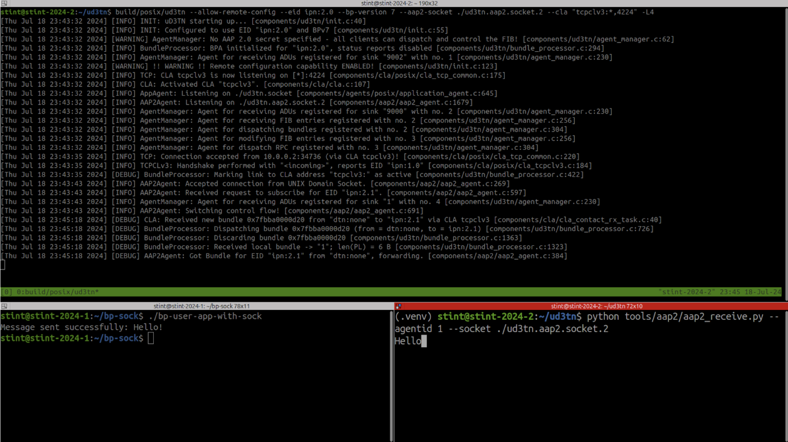

# Bp-socket

BP-Kernel is a project designed to tackle a core DTN problem: providing a clean, interoperable API to facilitate application developers in sending data using the Bundle Protocol (BP).

The core objective of this project is to extend the Linux networking stack by introducing a new address family specifically for BP communication. The new address family, `BP_AF`, offers a protocol abstraction that aligns with the **Interplanetary Networking (IPN) Scheme Naming and Addressing**.

BP-Kernel consists of two key components:

1. **Kernel Module**: Provides a kernel-level abstraction for DTN communication with IPN scheme.
2. **User-Space Daemon**: Acts as a pass-through service, facilitating communication between the kernel and the ION (Interplanetary Overlay Network) daemon, which handles the actual BP processing.

## Table of Contents

- [Bp-socket](#bp-socket)
  - [Table of Contents](#table-of-contents)
  - [Architecture](#architecture)
  - [Outcome](#outcome)
  - [Prerequisites](#prerequisites)
  - [Getting started](#getting-started)

## Architecture

The resulting “BP Sockets” interface integrates with bundle protocol stacks in user space. Netlink IPC (Inter-Process Communication) coordinates kernel and user space interactions. The main elements of the architecture are described below.


<details close>
<summary>BP Sockets Application</summary>
<br>
The user application creates a socket with a newly introduced address family 28, with the datagram (DGRAM) type and protocol number 0. The destination EID is provided via the sockaddr parameter of the sendto() function, and the Application Data Unit (ADU) to be conveyed via BP is provided in the message field.
<br><br>
</details>

<details close>
<summary>BP Sockets Kernel Module</summary>
<br>
A kernel module processes BP Sockets calls. This module uses Netlink to deliver the bundle payload and related metadata to the BP Sockets Daemon. Netlink is a communication protocol between the Linux kernel and userspace processes designed for asynchronous message passing.
<br><br>
</details>

<details close>
<summary>BP Sockets Daemon</summary>
<br>
Upon receiving a message, the BP Sockets Daemon in userspace retrieves the EID and the ADU, creates a bundle with ION, and sends it to the peer. In our case, the destination was running µD3TN on a second virtual machine (VM). This way, we demonstrated interoperability between µD3TN and ION using the BP Sockets interface.  Note that the BP Sockets Daemon is modular and not locked to ION; it could easily be adapted to another Bundle Protocol implementation.
<br><br>
</details>

## Outcome

It was demonstrated by transmitting bundles from a minimal user space application through the Linux kernel and ION to µD3TN using BP Sockets. The screenshot below shows the µD3TN log (the receiving BP node) on the top, the BP Sockets App sender on the bottom left, and the BP App receiver output on the bottom right.



## Prerequisites

- NFS
- Libvirt (and QEMU)
- [Vagrant](https://developer.hashicorp.com/vagrant/downloads)
- [Vagrant Libvirt](https://vagrant-libvirt.github.io/vagrant-libvirt/)

## Getting started

To set up the development environment outlined in the [Architecture](#architecture) section, we are going to create two virtual machines (`ion-node` and `ud3tn-node`).

> ⚠️ IMPORTANT:
> It is highly recommended to use `ion-node` (VM1) as your development environment. This VM already includes the necessary tools and dependencies. By working directly on VM1, you can simplify testing and avoid additional setup on your local machine.

1. Create VMs

```bash
vagrant up
```

2. SSH on `ion-node`, navigate to the `/vagrant` directory and see your `bp-socket` local repository

```bash
vagrant ssh ion
cd /vagrant
ls
```

3. [From `ion-node`] Run ION, load `bp.ko` file and run dameon

```bash
sudo -i

export LD_LIBRARY_PATH="/usr/local/lib"
ionstart -I /home/vagrant/host.rc

# Load bp kernel module
cd /vagrant/src/kernel
make
insmod bp.ko

# Run daemon
cd /vagrant/src/daemon
make
./bp_daemon
```

4. [From `ion-node`] Run userspace demo application

> ⚠️ IMPORTANT:
> You need to open a new shell and wait for setting up µD3TN (VM2 Setup).

<details open>
<summary>Sender</summary>
<br>

```bash
cd /vagrant/tools

gcc -o bp-demo-sender bp-demo-sender.c
./bp-demo-sender ipn:<HOST_ID_DESTINATION>.<AGENT_ID_DESTINATION>
# Example for '192.168.122.182': ./bp-demo-sender ipn:182.1
```
</details>

<details close>
<summary>Receiver</summary>
<br>

```bash
cd /vagrant/tools

gcc -o bp-demo-receiver bp-demo-receiver.c
./bp-demo-receiver <AGENT_ID_SOURCE>
# Example: ./bp-demo-receiver 1
```
</details>

5. SSH on `ud3tn-node`

```bash
vagrant ssh ud3tn
```

6. [From `ud3tn-node`] Run ud3tn

```bash
sudo -i
cd /home/vagrant/ud3tn/
build/posix/ud3tn \
    --allow-remote-config \
    --eid ipn:<HOST_ID_SOURCE>.0 \
    --aap2-socket ./ud3tn.aap2.socket.2 \
    --cla "tcpclv3:*,4556" -L 4
# Example for '192.168.122.140': build/posix/ud3tn \
# --allow-remote-config \
# --eid ipn:140.0 \
# --aap2-socket ./ud3tn.aap2.socket.2 \
# --cla "tcpclv3:*,4556" -L 4
```

7. [From `ud3tn-node`] Send and/or receive message

> ⚠️ IMPORTANT:
> You need to open a new shell.

<details open>
<summary>Run the AAP2 Receiver</summary>
<br>

```bash
sudo -i
cd /home/vagrant/ud3tn/

source .venv/bin/activate
python3 tools/aap2/aap2_receive.py --agentid <AGENT_ID_SOURCE> --socket ./ud3tn.aap2.socket.2
# Example: python3 tools/aap2/aap2_receive.py 
# --agentid 1 \
# --socket ./ud3tn.aap2.socket.2
```
</details>

<details close>
<summary>Run the AAP2 Sender</summary>
<br>

```bash
sudo -i
cd /home/vagrant/ud3tn/

source .venv/bin/activate

# Add outgoing contact to ION node
python3 tools/aap2/aap2_config.py --socket ./ud3tn.aap2.socket.2 --schedule 1 86400 100000 ipn:<HOST_ID_DESTINATION>.0 tcpclv3:<ADDRESS_DESTINATION>:4556
# Example for '192.168.122.182': python3 tools/aap2/aap2_config.py \
# --socket ./ud3tn.aap2.socket.2 \
# --schedule 1 86400 100000 \
# ipn:182.0 tcpclv3:192.168.122.182:4556

# Send payload to ION node
python3 tools/aap2/aap2_send.py --agentid <AGENT_ID_SOURCE> --socket ./ud3tn.aap2.socket.2 ipn:<HOST_ID_DESTINATION>.<AGENT_ID_DESTINATION> "Hello from ud3tn!" -v
# Example for '192.168.122.182': python3 tools/aap2/aap2_send.py \
# --agentid 1 \
# --socket ./ud3tn.aap2.socket.2 \
# ipn:140.1 "Hello from ud3tn!" -v
```
</details>
