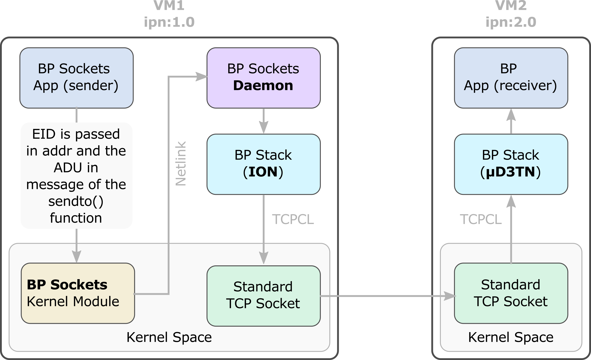
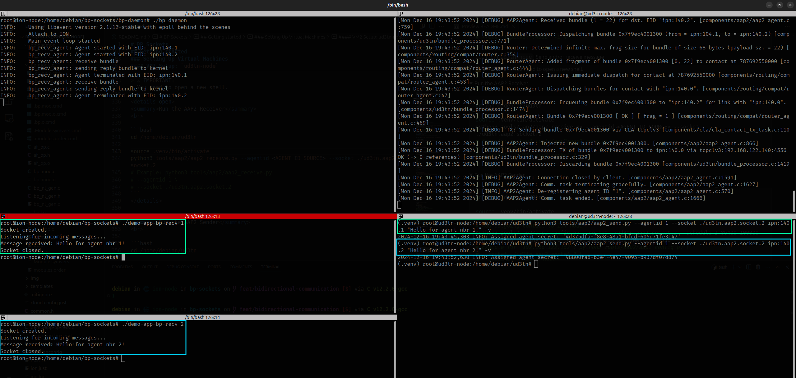

# Bp-socket

Bp-socket is a project designed to tackle a core DTN problem: providing a clean, interoperable API to facilitate application developers in sending data using the Bundle Protocol (BP).

The core objective of this project is to extend the Linux networking stack by introducing a new address family specifically for BP communication. The new address family, `BP_AF`, offers a protocol abstraction that aligns with the **Interplanetary Networking (IPN) Scheme Naming and Addressing**.

Bp-socket consists of two key components:

1. **Kernel Module**: Provides a kernel-level abstraction for DTN communication with IPN scheme.
2. **User-Space Daemon**: Acts as a pass-through service, facilitating communication between the kernel and the ION (Interplanetary Overlay Network) daemon, which handles the actual BP processing.

## Table of Contents

- [Bp-socket](#bp-socket)
  - [Table of Contents](#table-of-contents)
  - [Architecture](#architecture)
  - [Outcome](#outcome)
  - [Prerequisites](#prerequisites)
  - [Getting started](#getting-started)
  - [Using the BP Socket capabilities (Sending and Receiving)](#using-the-bp-socket-capabilities-sending-and-receiving)
    - [Scenario 1 — Send message from `ion-node` to `ud3tn-node`](#scenario-1--send-message-from-ion-node-to-ud3tn-node)
    - [Scenario 2 — Send message from `ud3tn-node` to `ion-node`](#scenario-2--send-message-from-ud3tn-node-to-ion-node)

## Architecture

The resulting “BP Sockets” interface integrates with bundle protocol stacks in user space. Netlink IPC (Inter-Process Communication) coordinates kernel and user space interactions. The main elements of the architecture are described below.



<details close>
<summary>Application</summary>
<br>
The user application creates a socket with a newly introduced address family 28, with the datagram (DGRAM) type and protocol number 0. The destination EID is provided via the sockaddr parameter of the sendto() function, and the Application Data Unit (ADU) to be conveyed via BP is provided in the message field.
<br><br>
</details>

<details close>
<summary>Kernel Module</summary>
<br>
A kernel module processes BP Sockets calls. This module uses Netlink to deliver the bundle payload and related metadata to the BP Sockets Daemon. Netlink is a communication protocol between the Linux kernel and userspace processes designed for asynchronous message passing.
<br><br>
</details>

<details close>
<summary>Daemon</summary>
<br>
Upon receiving a message, the BP Sockets Daemon in userspace retrieves the EID and the ADU, creates a bundle with ION, and sends it to the peer. In our case, the destination was running µD3TN on a second virtual machine (VM). This way, we demonstrated interoperability between µD3TN and ION using the BP Sockets interface.  Note that the BP Sockets Daemon is modular and not locked to ION; it could easily be adapted to another Bundle Protocol implementation.
<br><br>
</details>

## Outcome

It was demonstrated by transmitting bundles from a minimal user space application through the Linux kernel and ION to µD3TN using BP Sockets. The screenshot below shows the µD3TN log (the receiving BP node) on the top, the BP Sockets App sender on the bottom left, and the BP App receiver output on the bottom right.



## Prerequisites

- RSync
- Libvirt (and QEMU)
- [Vagrant](https://developer.hashicorp.com/vagrant/downloads)
- [Vagrant Libvirt](https://vagrant-libvirt.github.io/vagrant-libvirt/)

## Getting started

To set up the development environment described in the [Architecture](#architecture) section, you will launch two virtual machines: (`ion-node` and `ud3tn-node`).

> ⚠️ IMPORTANT:
> It is highly recommended to use `ion-node` (VM1) as your development environment. This VM already includes the necessary tools and dependencies. By working directly on VM1, you can simplify testing and avoid additional setup on your local machine.

1. Create the virtual machines

Start both VMs with:

```bash
vagrant up
```

2. Enable automatic file synchronization on `ion-node`

To keep your local `bp-socket` project synced with the `/vagrant` directory on `ion-node`, run:
   
```bash
vagrant rsync-auto
```

> Make sure to keep this process running in a separate terminal during development.

3. Preparing `ion-node` and `ud3tn-node`

<details open>
<summary><strong>ud3tn-node</strong></summary>

a) SSH into the VM and start the uD3TN process:

```bash
vagrant ssh -c "sudo -i" ud3tn
cd /home/vagrant/ud3tn/

build/posix/ud3tn \
    --allow-remote-config \
    --eid ipn:20.0 \
    --aap2-socket ./ud3tn.aap2.socket.2 \
    --cla "tcpclv3:*,4556" -L 4
```

b) Then, in another terminal, add an outgoing contact to the ION node:

```bash
vagrant ssh -c "sudo -i" ud3tn

cd /home/vagrant/ud3tn/
source .venv/bin/activate
python3 tools/aap2/aap2_config.py \
  --socket ./ud3tn.aap2.socket.2 \
  --schedule 1 86400 100000 \
  ipn:10.0 tcpclv3:192.168.50.10:4556
```
</details>

<details open>
<summary><strong>ion-node</strong></summary>

a) SSH into the VM and become root:

```bash
vagrant ssh -c "sudo -i" ion
```

b) Start ION:

```bash
cd /vagrant/configs
export LD_LIBRARY_PATH="/usr/local/lib"
ionstart -I ./host.rc
```

c) Build and insert the **Bundle Protocol (BP)** kernel module:

```bash
cd /vagrant/src/kernel
make
insmod bp.ko
```

d) Build and launch the userspace daemon:

```bash
cd /vagrant/src/daemon
make
./bp_daemon
```

</details>

## Using the BP Socket capabilities (Sending and Receiving)

This section demonstrates bidirectional message exchange between `ion-node` and `ud3tn-node` by opening sockets from the custom `AF_BP` socket family.

### Scenario 1 — Send message from `ion-node` to `ud3tn-node`

<details open>
<summary><strong>ud3tn-node (receiver)</strong></summary>

```bash
vagrant ssh -c "sudo -i" ud3tn

cd /home/vagrant/ud3tn/
source .venv/bin/activate
python3 tools/aap2/aap2_receive.py --agentid 2 --socket ./ud3tn.aap2.socket.2
```
</details>

<details open>
<summary><strong>ion-node (sender)</strong></summary>

```bash
vagrant ssh ion

cd /vagrant/tools
gcc -o bp-demo-sender bp-demo-sender.c
./bp-demo-sender ipn:20.2
```
</details>

### Scenario 2 — Send message from `ud3tn-node` to `ion-node`

<details open>
<summary><strong>ion-node (receiver)</strong></summary>

```bash
vagrant ssh ion

cd /vagrant/bp-socket/tools
gcc -o bp-demo-receiver bp-demo-receiver.c
./bp-demo-receiver ipn:10.2
```
</details>

<details open> 
<summary><strong>ud3tn-node (sender)</strong></summary>
  
```bash
vagrant ssh -c "sudo -i" ud3tn

cd /home/vagrant/ud3tn/
source .venv/bin/activate
python3 tools/aap2/aap2_send.py --agentid 2 --socket ./ud3tn.aap2.socket.2 ipn:10.2 "Hello from ud3tn!" -v
```
</details>

